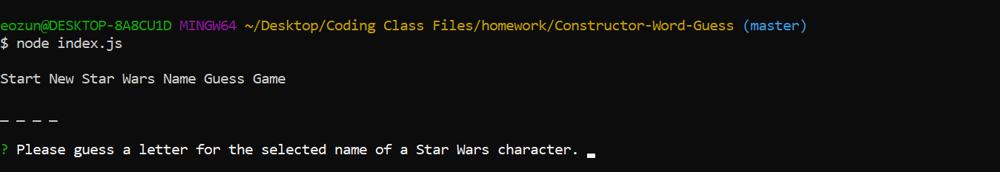
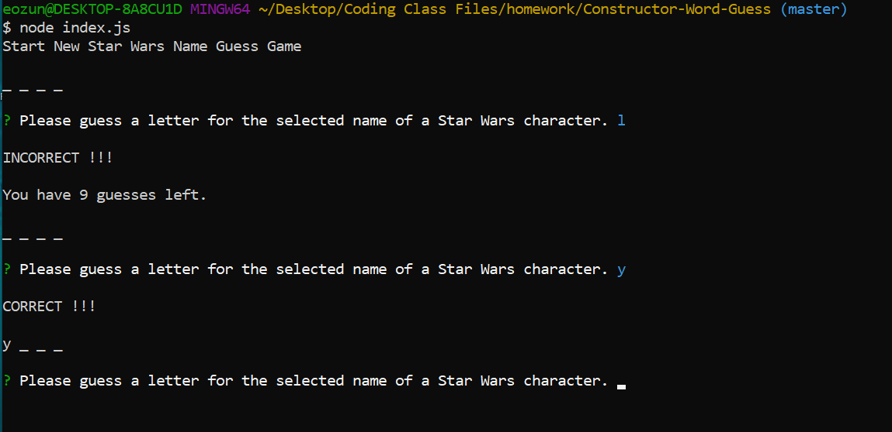
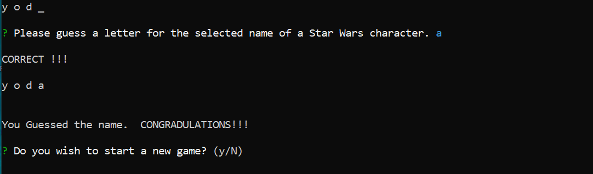
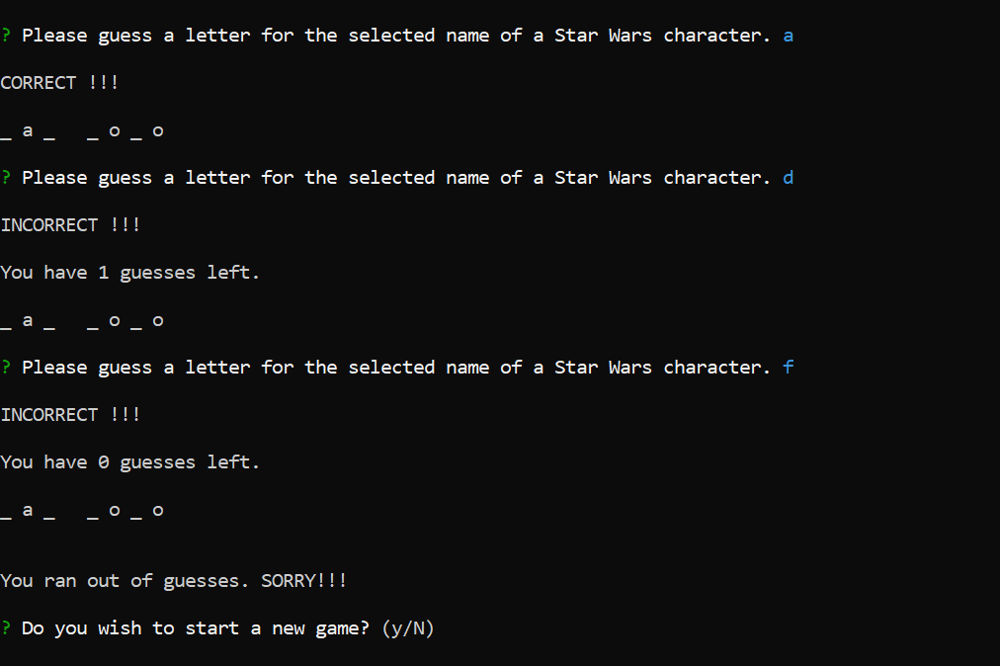

# Constructor Word Guess Game (First Constructor application)

### Overview
This application is a CLI node application that is has the user play a version of Stars Character name hangman game.  The application randomly selects one of 10 names, and then using the inquirer module prompts the user to play the game via command line interactions.  The application uses a couple of constructors in seperate files to uses as part of the games logic.  This application is my first use of constructors for creation of objects and combining that with node and CLI .  I was the sole creator of this application.

### How the application is organized
This application uses 3 seperate javascript files; Letter.js, Word,js, and index.js.  Letter.js and Word.js both hold constructors for objects that are used for the logic of the application.  The index.js file is the main file that runs and hold the code for the running the game.

The first part of index.js file involves requiring access to all of the previously installed modules for use in the application.  It also requires the constructors created in the other 2 files for use.  Finally it also creates global variables, arrays, and objects to use throughout the game along with an array holding a list of names to choose from. 

Next several functions were created to operate the logic of the game.  First a function was used to randomly select a position in the name array to use for the game.  The randomly selected name is then used by the following function *(creatWordObject)* to create an array of letter objects in a larger word object.  The next function *(beginNewGame)* actually starts or restarts the game, setting all the global variables, arrays, and objects to their original values to use in the game.  Next, a *playGame* function is called that prompts the user to enter in a letter to guess.  The *playGame* function validates the users input, and makes sure the entered letter has not previously been choosen.  Then it runs a series of if else statements to confirm whether the entered letter completes the name at which point the game ends and it notifies the users they won.  Otherwise it continues on with the game if the user still has guess left.  If the user runs out of guess before they complete the name, then the game ends and the user is notified they lost. 

Finally, whenever the player wins or losses a final function called *playAgain* is called.  This function uses the inquirer module and prompts the user to choose whether to play the game again or quit.

### Technologies used in the application
1.  Javascript
2.  Node.js
3.  Constructors
4.  Inquirer NPM

## Instructions for use of the application
### Before using the app
Before you can start to use the app you will need to install the **Inquirer** module.  To install the module, type in the code below on the command line.

`$ npm install inquirer`

Here is a link to the documentation for inquirer to use as a reference 
* [inquirer](https://www.npmjs.com/package/inquirer)

### Running the application
To start the application you will need to type in the following code into the command line terminal.

`$ node index.js`

#### Playing the Game
The application outputs that the game has started, and outputs a series of underscores representing the number of letters in the name which the user will guess. Below is a screen shot of this initial 

  

#### How to uses the CLI for playing the game
The command line will only accept letters (either lowercase or uppercase) as inputs for the game.  Any other entry will not allow the game to continue.  Also leaving the input blank as well to not allow the game to move forward.

Once the user has entered a letter into the CLI the game moves on and will either notify the user if the letter they entered is a letter in the name they are trying to guess or whether it is not.  Below is a screen shot of this example.

  

Once the user has correctly guessed the name of the character before they run out of guesses then the application outputs that the user won and asks if the user wishes to play the game again.  Below is a screen shot of this example.

  

If the user enters "yes" or "y", then the game will restart and a new character name will be choosen.  Otherwise, if the user types in "no", "n", or justs hit enter the game will end and the application will stop.  If you wish to play other game after the application stops you will have to re-enter the CLI code above to restart the application.

If the player runs out of guesses before they correctly complete the name, then the application outputs that the user lost, and asks if the user wishes to play the game again.  If the user enters "yes" or "y", then the game will restart and a new character name will be choosen.  Otherwise, if the user types in "no", "n", or justs hit enter the game will end and the application will stop.  If you wish to play other game after the application stops you will have to re-enter the CLI code above to restart the application.  Below is a screen shot of this example.

## Links associated with the application
1.  Link to git hub repository for this app:  [Github Link](https://github.com/eozuna3/Constructor-Word-Guess)
2. Here is a links to videos showing how the application functions: [Constructor-Word-Guess-Game](https://drive.google.com/file/d/1hbL28NIDCxZHkX-bcyZsvZi0PUa5oiIH/view?usp=sharing)
